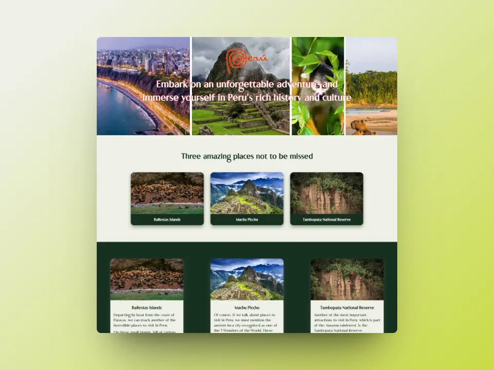

# Hometown Homepage

This is my solution for **Solo Project: Hometown homepage** of [**Frontend Career Path**](https://scrimba.com/learn/frontend) - **Module 2** by [**Scrimba**](https://scrimba.com/).

### Table Contents

+ [Screenshots](#screenshots)
+ [Links](#links)
+ [Useful resources](#useful-resources)
+ [Author](#author)

## Screenshots
### 📱 Mobile

### 💻 Desktop

## Links

[Live](https://mendez-v.github.io/hometown-homepage/) 👀

[Scrim](https://scrimba.com/scrim/c6rkzbt3) 👀

## Useful resources

🌈 Icons - [IconScout](https://iconscout.com/)

🌈 Colors - [Color Hunt](https://colorhunt.co/)

🌈 Fonts - [DaFont](https://www.dafont.com/es/)

## Author

✨ Frontend Mentor - [@mendez-v](https://www.frontendmentor.io/profile/mendez-v)